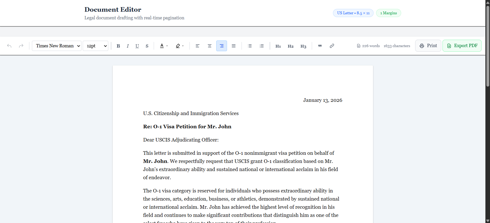
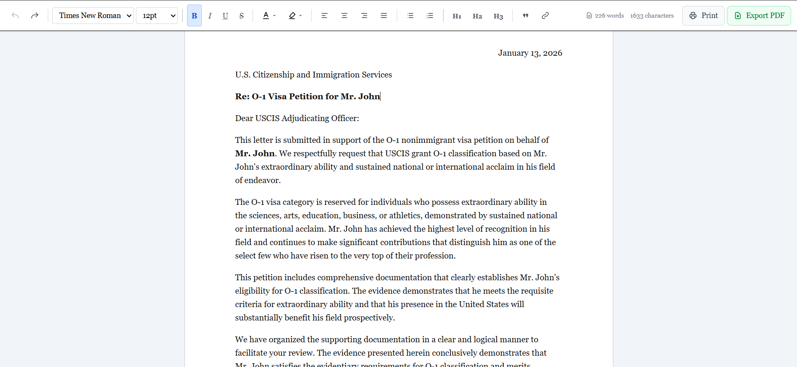
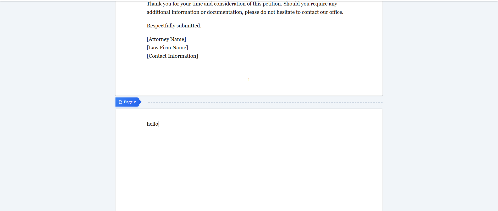
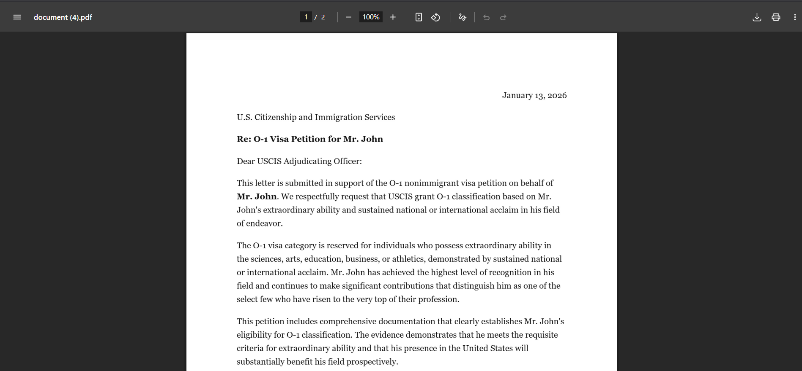

<p align="center">
  
  
  
  
</p>

<h1 align="center">📄 Document Pagination Editor</h1>

<p align="center">
  <strong>A Tiptap-based rich text editor with real-time page break visualization for legal documents</strong>
</p>

<p align="center">
  <a href="https://tip-tap-pagination-editor.vercel.app">🌐 Live Demo</a> •
  <a href="#-features">✨ Features</a> •
  <a href="#-quick-start">🚀 Quick Start</a> •
  <a href="#-how-it-works">🔧 How It Works</a>
</p>

---

## 📸 Preview

<!-- Add your screenshot here -->
<!-- Take a screenshot of the full editor and save it as 'preview.png' in a folder called 'screenshots' -->

<p align="center">
  
</p>

<p align="center"><em>Clean document editor with real-time pagination indicators</em></p>

---

## 🎯 Problem Statement

Immigration lawyers draft legal documents (cover letters, petitions, support letters) for USCIS submission. They need to visualize **exactly where page breaks occur** while typing — similar to Microsoft Word or Google Docs.

**Without this feature:**
- Lawyers must print/export repeatedly to check formatting
- Risk of awkward page breaks in submitted documents
- Time wasted on manual adjustments

**With this editor:**
- See page breaks in real-time as you type
- Export clean PDFs matching screen layout
- Draft with confidence knowing what each page will look like

---

## ✨ Features

<table>
<tr>
<td width="50%">

### 📝 Rich Text Editing
- Bold, Italic, Underline, Strikethrough
- Headings (H1, H2, H3)
- Bullet & Numbered lists
- Blockquotes & Links
- Text alignment options

</td>
<td width="50%">

### 🎨 Formatting Options
- 6 Font families
- 8 Font sizes (10pt - 36pt)
- 7 Text colors
- 6 Highlight colors
- Undo/Redo support

</td>
</tr>
<tr>
<td width="50%">

### 📄 Page Break Detection
- Real-time pagination markers
- US Letter (8.5" × 11") format
- 1-inch margins
- Dynamic updates on edit

</td>
<td width="50%">

### 📤 Export Options
- **Export PDF** - Clean output, no headers
- **Print** - Browser print dialog
- Word & character count
- Page count display

</td>
</tr>
</table>

---

## 📸 Screenshots

### Editor Interface

<p align="center">
  
</p>

<p align="center"><em>Professional toolbar with all formatting options</em></p>

### Page Break Indicator

<p align="center">
  
</p>

<p align="center"><em>Visual "Page 2" marker appears exactly where content will break when printed</em></p>

### Export to PDF

<p align="center">
  
</p>

<p align="center"><em>Clean PDF export without browser headers/footers</em></p>

---

## 🚀 Quick Start

### Prerequisites
- Node.js 18+ 
- npm or yarn

### Installation

```bash
# Clone the repository
git clone https://github.com/Swordship/TipTap-Pagination-Editor

# Navigate to project
cd tiptap-pagination-editor

# Install dependencies
npm install

# Start development server
npm run dev
```

### Open in Browser
```
http://localhost:3000
```

---

## 📦 Dependencies

```bash
# Core Editor
npm install @tiptap/react @tiptap/starter-kit @tiptap/pm

# Extensions
npm install @tiptap/extension-underline @tiptap/extension-text-align
npm install @tiptap/extension-link @tiptap/extension-text-style
npm install @tiptap/extension-font-family @tiptap/extension-color
npm install @tiptap/extension-highlight

# Utilities
npm install lodash html2pdf.js
```

---

## 🔧 How It Works

### Page Break Algorithm

```
┌─────────────────────────────────────┐
│         Content Block 1             │
│         Content Block 2             │
│         Content Block 3             │
│         ...                         │
│         Content Block N             │  ← Exceeds 864px (9 inches)
├─────────────────────────────────────┤
│      📄 Page 2 ─────────────        │  ← Marker inserted
├─────────────────────────────────────┤
│         Content Block N+1           │
│         ...                         │
└─────────────────────────────────────┘
```

### The Process

```javascript
// 1️⃣ Measure all content blocks
const blocks = document.querySelectorAll('p, h1, h2, h3, li, blockquote');

// 2️⃣ Check each block's position
blocks.forEach((block, index) => {
  const position = block.getBoundingClientRect();
  
  // 3️⃣ If block crosses page boundary (864px)
  if (position.bottom > PAGE_HEIGHT) {
    // 4️⃣ Insert page break marker
    insertPageBreak(index);
  }
});
```

### Key Constants

| Constant | Value | Description |
|----------|-------|-------------|
| `PAGE_WIDTH` | 816px | 8.5 inches at 96 DPI |
| `PAGE_HEIGHT` | 1056px | 11 inches at 96 DPI |
| `MARGIN` | 96px | 1 inch margins |
| `PRINTABLE_HEIGHT` | 864px | 9 inches of content area |

---

## 📁 Project Structure

```
tiptap-pagination-editor/
│
├── 📂 app/
│   ├── 📄 page.tsx          # Main page component
│   ├── 📄 layout.tsx        # Root layout
│   └── 📄 globals.css       # Styles + print CSS
│
├── 📂 components/
│   ├── 📄 Editor.tsx        # Editor + pagination logic
│   └── 📄 Toolbar.tsx       # Formatting toolbar
│
├── 📂 screenshots/          # Add your screenshots here
│   ├── 📷 preview.png
│   ├── 📷 editor-full.png
│   ├── 📷 page-break.png
│   └── 📷 export-pdf.png
│
└── 📄 README.md
```

---

## ✅ Requirements Checklist

### Core Requirements

| # | Requirement | Status |
|---|-------------|--------|
| 1 | Display visual page breaks | ✅ Done |
| 2 | Dynamic updates on content change | ✅ Done |
| 3 | US Letter size (8.5" × 11") | ✅ Done |
| 4 | 1-inch margins | ✅ Done |
| 5 | Support headings & paragraphs | ✅ Done |
| 6 | Support bold/italic text | ✅ Done |
| 7 | Support bullet points | ✅ Done |
| 8 | Handle content reflow | ✅ Done |

### Optional Enhancements

| # | Enhancement | Status |
|---|-------------|--------|
| 1 | Page numbers | ✅ Done |
| 2 | Export to PDF | ✅ Done |
| 3 | Print functionality | ✅ Done |
| 4 | Header/footer support | ❌ Not implemented |
| 5 | Table support | ❌ Not implemented |

---

## ⚠️ Known Limitations

### 1. Block-Level Breaks Only

```diff
- Page breaks occur between paragraphs, not mid-paragraph
+ Workaround: Keep paragraphs reasonably sized (standard for legal docs)
```

### 2. Browser Print Headers

```diff
- Browser adds date/URL/page numbers when using Print
+ Workaround: Use "Export PDF" button for clean output
```

### 3. Screen vs Print Variance

```diff
- Different browsers may render slightly differently
+ Workaround: Export PDF provides consistent output
```

---

## 🔮 Future Improvements

| Feature | Description | Priority |
|---------|-------------|----------|
| Line-level pagination | Split long paragraphs at line boundaries | High |
| Auto-save | Save to localStorage to prevent data loss | High |
| Document templates | Pre-built formats for common legal docs | Medium |
| Headers/Footers | Repeating content on each page | Medium |
| Table support | Tables with proper page break handling | Low |
| Collaborative editing | Real-time multi-user editing with Y.js | Low |

---

## 🛠️ Tech Stack

<p align="center">
  
</p>

| Technology | Purpose |
|------------|---------|
| **Next.js 14** | React framework with App Router |
| **Tiptap 2.x** | Headless rich text editor |
| **TypeScript** | Type-safe development |
| **Tailwind CSS** | Utility-first styling |
| **html2pdf.js** | Client-side PDF generation |
| **Vercel** | Deployment platform |

---

## 📝 Key Learnings

> 💡 **DOM Measurement** — Using `getBoundingClientRect()` for accurate measurements instead of relying on theoretical CSS values.

> 💡 **Debouncing** — Essential for performance when recalculating pagination on every keystroke.

> 💡 **Print CSS Limitations** — Web apps can't fully control browser print behavior; PDF export is more reliable.

> 💡 **Simplicity Wins** — A continuous layout with markers proved more reliable than complex page containers.

---

## 🚀 Deployment

The app is deployed on Vercel:

**🌐 Live Demo:** [https://tip-tap-pagination-editor.vercel.app](https://tip-tap-pagination-editor.vercel.app)

To deploy your own:

```bash
# Install Vercel CLI
npm install -g vercel

# Deploy
vercel
```

---

## 📧 Author

<p align="center">
  <strong>Built by Monish</strong><br>
  OpenSphere Full-Stack Intern Assignment
</p>

---

<p align="center">
  <em>This project was built with AI assistance (Claude,Gpt,Gemini), with full understanding of the code and implementation decisions — as permitted by the assignment guidelines.</em>
</p>

---

<p align="center">
  <strong>⭐ Star this repo if you found it helpful!</strong>
</p>